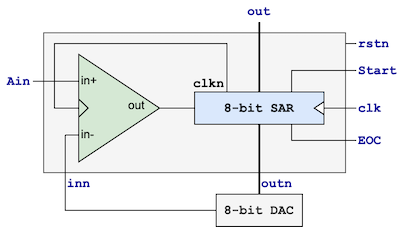

# All digital SAR ADC
The purpose of this project is to use digital standard cells to implement analog functions. This opens the door for realizing the layout of these analog functions using digital Place and Route (PnR) tools.
The repo contains:
- A digital standard cells based clocked analog comparator for Sky130A process (ACMP). 
- A 8-bit SAR ADC built around ACMP and [VSD POTENTIOMETRIC DAC](https://github.com/vsdip/avsddac_3v3_sky130_v1)

## All digital Analog Comparator (ACMP)
Analog comparator using digital standard cells for SKY130A process similar to the design outlined by [1](#References).

## 8-bit Successive Approximation Register (SAR) ADC

## References
1) Li, X., Zhou, T., Ji, Y. et al. A 0.35 V-to-1.0 V synthesizable rail-to-rail dynamic voltage comparator based OAI&AOI logic. Analog Integr Circ Sig Process 104, 351–357 (2020)